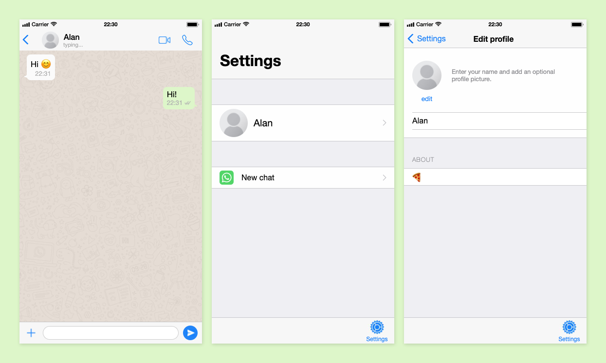

# WhatSocket

Chat app made with Socket.io and Node.js. Styled after Whatsapp.

[Demo](https://whatsocket.herokuapp.com)



## Usage

```
$ npm start
```

This will start a server on localhost:4000

#### Settings

Edit your profile info or start a new chat.

#### Edit profile

Change your name and about info. It will be saved to localStorage.

#### New chat

Start a new chat. Send the link with the chat id to another person to start chatting.
